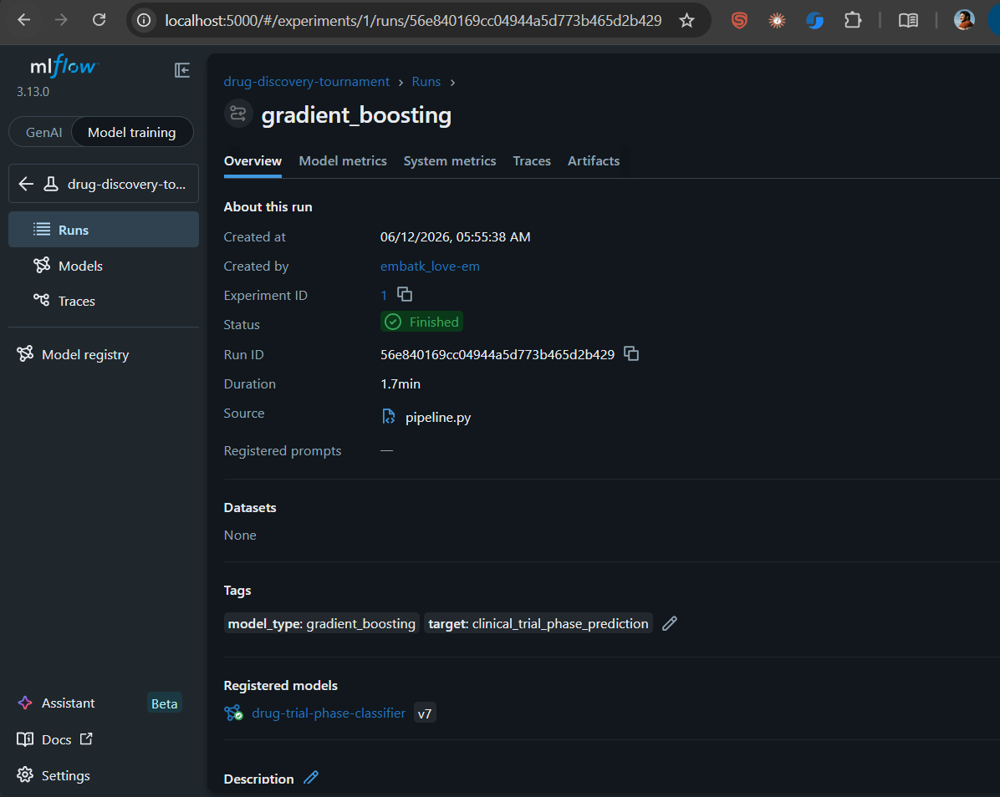

# Drug Discovery ML Tournament Pipeline

> Automated machine learning tournament that trains 7 classifiers on drug candidate data, tracks every run with MLflow, and auto-promotes the best model to Production.



---

## What This Project Does

Pharmaceutical companies spend **$2 billion+** testing drug candidates in clinical trials. Most fail. This pipeline simulates an early-stage ML filter: given molecular properties of a drug candidate, predict which clinical trial phase it will reach — so researchers can prioritize compounds with the most promise.

Seven models compete. MLflow tracks every metric, artifact, and parameter. The winner gets auto-promoted to the Model Registry as **Production**. Any future challenger must beat the current champion to take its place.

---

## MLflow Architecture — What Gets Exercised

```
┌─────────────────────────────────────────────────────────────┐
│                        pipeline.py                          │
│                                                             │
│  ┌──────────┐    ┌─────────────┐    ┌────────────────────┐ │
│  │  Data    │───▶│  7 Models   │───▶│   MLflow Tracking  │ │
│  │  Prep    │    │  Training   │    │   - params         │ │
│  └──────────┘    └─────────────┘    │   - metrics        │ │
│                                     │   - artifacts      │ │
│                                     │   - confusion mats │ │
│                                     └────────┬───────────┘ │
│                                              │             │
│                                     ┌────────▼───────────┐ │
│                                     │  Model Registry    │ │
│                                     │  Staging ──▶ Prod  │ │
│                                     └────────┬───────────┘ │
│                                              │             │
│                                     ┌────────▼───────────┐ │
│                                     │  REST Serving      │ │
│                                     │  mlflow models     │ │
│                                     │  serve             │ │
│                                     └────────────────────┘ │
└─────────────────────────────────────────────────────────────┘
```

| MLflow Component | How It's Used |
|---|---|
| **Tracking Server** | SQLite backend stores all runs, metrics, params |
| **Experiments** | All 7 model runs grouped under `drug-discovery-tournament` |
| **Runs** | One run per model — full lifecycle tracked |
| **Artifacts** | Confusion matrix PNGs logged per run |
| **Model Registry** | Winner registered as `drug-trial-phase-classifier` |
| **Staging → Production** | Auto-promotion pipeline on tournament completion |
| **Model Serving** | Load Production model via REST endpoint |
| **MLproject** | Reproducible entry point via `mlflow run .` |

---

## Dataset — AI Drug Discovery Molecule Analytics

**2,800 drug candidates** with 11 molecular features. Each row represents a compound being evaluated for development.

| Feature | Description |
|---|---|
| `molecular_weight` | Mass of the molecule |
| `logP` | Fat/water solubility ratio — affects absorption |
| `num_hydrogen_bond_donors` | Molecule-protein binding potential |
| `num_hydrogen_bond_acceptors` | Molecule-protein binding (other direction) |
| `topological_polar_surface_area` | Membrane permeability indicator |
| `rotatable_bonds` | Molecular flexibility |
| `aromatic_rings` | Ring-shaped carbon structures |
| `bioactivity_score` | 0–1 activity score against disease target |
| `binding_affinity_kcal_mol` | Protein binding strength (more negative = stronger) |

**Target variable:** `clinical_trial_phase_prediction`

```
Preclinical  ████████████████████  40.1%   (1,122 compounds)
Phase I      ████████████          23.8%   (667 compounds)
Phase II     ██████████            20.6%   (578 compounds)
Phase III    ███████               15.5%   (433 compounds)
```

---

## Models in the Tournament

| Model | Handles Imbalance |
|---|---|
| Logistic Regression | `class_weight=balanced` |
| Random Forest | `class_weight=balanced` |
| XGBoost | Built-in |
| LightGBM | `class_weight=balanced` |
| SVM (RBF kernel) | `class_weight=balanced` |
| K-Nearest Neighbors | — |
| Gradient Boosting | — |

---

## Project Structure

```
mlflow/
├── data/
│   ├── raw/
│   │   └── drug_discovery_dataset.csv    # original dataset
│   └── processed/                         # cleaned features (auto-generated)
│
├── src/
│   ├── data/
│   │   └── preprocess.py                 # load, encode, scale, train/test split
│   ├── models/
│   │   └── train.py                      # all 7 model definitions
│   ├── evaluation/
│   │   └── evaluate.py                   # metrics, confusion matrix plots
│   └── serving/
│       └── predict.py                    # load Production model, run inference
│
├── configs/
│   └── config.yaml                       # hyperparams, target variable, registry settings
│
├── pipeline.py                           # master script — train, track, promote winner
├── MLproject                             # mlflow run . entrypoint
├── Dockerfile                            # container image definition
├── docker-compose.yml                    # orchestrates pipeline + UI containers
├── python_env.yaml                       # reproducible environment spec
├── requirements.txt
└── ss.png                                # MLflow UI screenshot
```

---

## Run With Docker (Recommended)

No Python, no venv, no pip. Just Docker.

```bash
docker-compose up --build
```

```
pipeline container  → trains all 7 models → logs to shared SQLite volume → exits
mlflow-ui container → reads same volume   → serves at localhost:5000
```

Open → `http://localhost:5000`

Watch runs appear live as models train.

**Stop everything:**
```bash
docker-compose down
```

**Wipe all run history and start fresh:**
```bash
docker-compose down -v
```

---

## Run Locally (Manual Setup)

**1. Create virtual environment**
```bash
python3 -m venv .venv
source .venv/bin/activate        # Windows: .venv\Scripts\activate
```

**2. Install dependencies**
```bash
pip install -r requirements.txt
```

**3. Start MLflow tracking UI** *(keep this terminal open)*
```bash
mlflow ui --backend-store-uri sqlite:///mlflow.db --port 5000
```
Open → `http://localhost:5000`

**4. Run the tournament** *(new terminal, venv active)*
```bash
python pipeline.py
```

Trains all 7 models (~5–10 min). Watch runs appear live in the UI.

---

## What Happens After `python pipeline.py`

```
1. Load & preprocess data        (encode labels, scale features, stratified split)
        ↓
2. Train 7 models                (each gets its own MLflow run)
        ↓
3. Log per run:
   - hyperparameters
   - accuracy, f1, precision, recall
   - confusion matrix PNG artifact
   - serialized model
        ↓
4. Compare all runs on f1_weighted
        ↓
5. Register winner in Model Registry
        ↓
6. Archive previous Production (if any)
        ↓
7. Promote winner → Production
```

---

## Switching the Prediction Target

Edit `configs/config.yaml`:

```yaml
experiment:
  target: "clinical_trial_phase_prediction"   # ← change this
```

Options:
- `clinical_trial_phase_prediction` — 4-class (Preclinical / Phase I / II / III)
- `toxicity_risk_level` — 3-class (Low / Medium / High)
- `drug_likeness` — binary (Yes / No)

---

## Serve the Production Model

After the tournament, serve the winning model as a REST API:

```bash
mlflow models serve \
  --model-uri "models:/drug-trial-phase-classifier/Production" \
  --port 8080 \
  --env-manager local
```

Query it:
```bash
curl -X POST http://localhost:8080/invocations \
  -H "Content-Type: application/json" \
  -d '{
    "dataframe_records": [{
      "molecular_weight": 387.25,
      "logP": 2.72,
      "num_hydrogen_bond_donors": 3,
      "num_hydrogen_bond_acceptors": 11,
      "topological_polar_surface_area": 88.96,
      "rotatable_bonds": 2,
      "aromatic_rings": 2,
      "bioactivity_score": 0.715,
      "binding_affinity_kcal_mol": -9.38,
      "drug_likeness": 0,
      "toxicity_risk_level": 0
    }]
  }'
```

---

## Reproduce With MLproject

```bash
mlflow run . -P target=clinical_trial_phase_prediction
```

Fully reproducible — environment, parameters, and entry point all defined in `MLproject`.

---

## Tech Stack

- **MLflow 3.13** — experiment tracking, model registry, serving
- **scikit-learn** — Logistic Regression, Random Forest, SVM, KNN, Gradient Boosting
- **XGBoost** — gradient boosted trees
- **LightGBM** — fast gradient boosting
- **SQLite** — MLflow tracking backend
- **Docker + Compose** — containerized, one-command reproducibility
- **Python 3.12**
